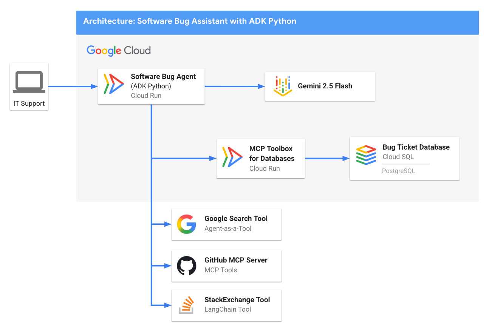
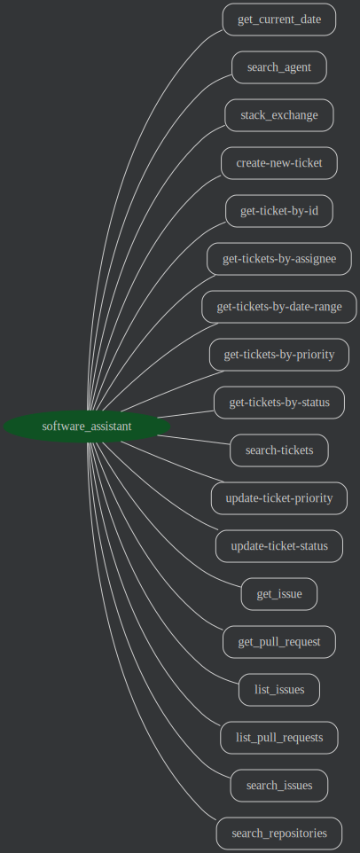

# Software Bug Assistant - ADK Python Sample Agent

## Overview

The Software Bug Assistant is a sample agent designed to help IT Support and Software Developers triage, manage, and resolve software issues. This sample agent uses ADK Python, a PostgreSQL bug ticket database (internal tickets), GitHub MCP server (external tickets), RAG, Google Search, and StackOverflow to assist in debugging. 



This README contains instructions for local and Google Cloud deployment. 

## Agent Details

The key features of the Software Bug Assistant Agent include:

| Feature | Description |
| --- | --- |
| **Interaction Type** | Conversational |
| **Complexity**       | Intermediate |
| **Agent Type**       | Single Agent |
| **Components**       | Tools, Database, RAG, Google Search, GitHub MCP |
| **Vertical**         | Horizontal / IT Support |

## Agent Architecture



## Key Features

*   **Retrieval-Augmented Generation (RAG):** Leverages Cloud SQL's built-in [Vertex AI ML Integration](https://cloud.google.com/sql/docs/postgres/integrate-cloud-sql-with-vertex-ai) to fetch relevant/duplicate software bugs.
*   **MCP Toolbox for Databases:** [MCP Toolbox for Databases](https://github.com/googleapis/genai-toolbox) to provide database-specific tools to our agent.
*   **GitHub MCP Server:** Connects to [GitHub's remote MCP server](https://github.com/github/github-mcp-server?tab=readme-ov-file#remote-github-mcp-server)
to fetch external software bugs (open issues, pull requests, etc).
*   **Google Search:** Leverages Google Search as a built-in tool to fetch
relevant search results in order to ground the agent's responses with external
up-to-date knowledge.
*   **StackOverflow:** Query [StackOverflow’s](https://stackoverflow.com/) powerful Q\&A data, using [LangChain’s extensive tools library](https://python.langchain.com/docs/integrations/tools/)— specifically, the [StackExchange API Wrapper tool.](https://python.langchain.com/docs/integrations/tools/stackexchange/). ADK comes with support for [third-party tools like LangChain tools](https://google.github.io/adk-docs/tools/third-party-tools/#1-using-langchain-tools)

## Setup and Installation

### Prerequisites 

- Python 3.9+
- [uv](https://docs.astral.sh/uv/getting-started/installation) (to manage dependencies)
- Git (for cloning the repository, see [Installation Instructions](https://git-scm.com/book/en/v2/Getting-Started-Installing-Git))
- Google Cloud CLI ([Installation Instructions](https://cloud.google.com/sdk/docs/install))

### Installation

1. Clone the repository:

```bash
git clone https://github.com/google/adk-samples.git
cd adk-samples/python/agents/software-bug-assistant
```

2. Configure environment variables (via `.env` file):

#### GitHub Personal Access Token (PAT)

To authenticate with the GitHub MCP server, you need a GitHub Personal Access Token.

1. Go to your GitHub [Developer settings](https://github.com/settings/tokens).
2. Click on "Personal access tokens" -> "Tokens (classic)".
3. Click "Generate new token" -> "Generate new token (classic)".
4. Give your token a descriptive name.
5. Set an expiration date for your token.
6. Important: For security, grant your token the most limited scopes necessary. For read-only access to repositories, the `repo:status`, `public_repo`, and `read:user` scopes are often sufficient. Avoid granting full repo or admin permissions unless absolutely necessary.
7. Click "Generate token".
8. Copy the generated token.

#### Gemini API Authentication

There are two different ways to authenticate with Gemini models:

- Calling the Gemini API directly using an API key created via Google AI Studio.
- Calling Gemini models through Vertex AI APIs on Google Cloud.

> [!TIP] 
> If you just want to run the sample locally, an API key from Google AI Studio is the quickest way to get started.
> 
> If you plan on deploying to Cloud Run, you may want to use Vertex AI.

<details open>
<summary>Gemini API Key</summary> 

Get an API Key from Google AI Studio: https://aistudio.google.com/apikey

Create a `.env` file by running the following (replace `<your_api_key_here>` with your API key and `<your_github_pat_here>` with your GitHub Personal Access Token):

```sh
echo "GOOGLE_API_KEY=<your_api_key_here>" >> .env \
&& echo "GOOGLE_GENAI_USE_VERTEXAI=FALSE" >> .env \
&& echo "GITHUB_PERSONAL_ACCESS_TOKEN=<your_github_pat_here>" >> .env
```

</details>

<details>
<summary>Vertex AI</summary>

To use Vertex AI, you will need to [create a Google Cloud project](https://developers.google.com/workspace/guides/create-project) and [enable Vertex AI](https://cloud.google.com/vertex-ai/docs/start/cloud-environment).

Authenticate and enable Vertex AI API:

```bash
gcloud auth login
# Replace <your_project_id> with your project ID
gcloud config set project <your_project_id>
gcloud services enable aiplatform.googleapis.com
```

Create a `.env` file by running the following (replace `<your_project_id>` with your project ID and `<your_github_pat_here>` with your GitHub Personal Access Token):

```sh
echo "GOOGLE_GENAI_USE_VERTEXAI=TRUE" >> .env \
&& echo "GOOGLE_CLOUD_PROJECT=<your_project_id>" >> .env \
&& echo "GOOGLE_CLOUD_LOCATION=us-central1" >> .env \
&& echo "GITHUB_PERSONAL_ACCESS_TOKEN=<your_github_pat_here>" >> .env
```

</details>


There is an example `.env` file located at [.env.example](.env.example) if you would like to
verify your `.env` was set up correctly.

Source the `.env` file into your environment:

```bash
set -o allexport && source .env && set +o allexport
```

3. Download [MCP Toolbox for Databases](https://github.com/googleapis/genai-toolbox)

```bash
export OS="linux/amd64" # one of linux/amd64, darwin/arm64, darwin/amd64, or windows/amd64
curl -O --output-dir deployment/mcp-toolbox https://storage.googleapis.com/genai-toolbox/v0.6.0/$OS/toolbox
chmod +x deployment/mcp-toolbox/toolbox
```

**Jump to**:
- [💻 Run Locally](#run-locally)
- [☁️ Deploy to Google Cloud](#deploy-to-google-cloud)

## 💻 Run Locally 

### Before you begin

Install PostgreSQL:

- [PostgreSQL - local instance and psql command-line tool](https://www.postgresql.org/download/)


### 1 - Start a local PostgreSQL instance.

For instance, on MacOS: 

```bash
brew services start postgresql
```

### 2 - Initialize the database. 

```bash
psql -U postgres
```

Then, initialize the database and `tickets` table: 

```SQL
CREATE DATABASE ticketsdb;
\c ticketsdb;
CREATE TABLE tickets (
    ticket_id SERIAL PRIMARY KEY,             -- PostgreSQL's auto-incrementing integer type (SERIAL is equivalent to INT AUTO_INCREMENT)
    title VARCHAR(255) NOT NULL,              -- A concise summary or title of the bug/issue.
    description TEXT,                         -- A detailed description of the bug.
    assignee VARCHAR(100),                    -- The name or email of the person/team assigned to the ticket.
    priority VARCHAR(50),                     -- The priority level (e.g., 'P0 - Critical', 'P1 - High').
    status VARCHAR(50) DEFAULT 'Open',        -- The current status of the ticket (e.g., 'Open', 'In Progress', 'Resolved'). Default is 'Open'.
    creation_time TIMESTAMP WITH TIME ZONE DEFAULT CURRENT_TIMESTAMP, -- Timestamp when the ticket was first created. 'WITH TIME ZONE' is recommended for clarity and compatibility.
    updated_time TIMESTAMP WITH TIME ZONE DEFAULT CURRENT_TIMESTAMP  -- Timestamp when the ticket was last updated. Will be managed by a trigger.
);
```

Insert some sample data:

```SQL
INSERT INTO tickets (title, description, assignee, priority, status) VALUES
('Login Page Freezes After Multiple Failed Attempts', 'Users are reporting that after 3 failed login attempts, the login page becomes unresponsive and requires a refresh. No specific error message is displayed.', 'samuel.green@example.com', 'P0 - Critical', 'Open');

INSERT INTO tickets (title, description, assignee, priority, status) VALUES
('Dashboard Sales Widget Intermittent Data Loading Failure', 'The "Sales Overview" widget on the main dashboard intermittently shows a loading spinner but no data. Primarily affects Chrome browser users.', 'maria.rodriguez@example.com', 'P1 - High', 'In Progress');

INSERT INTO tickets (title, description, assignee, priority, status) VALUES
('Broken Link in Footer - Privacy Policy', 'The "Privacy Policy" hyperlink located in the website footer leads to a 404 "Page Not Found" error.', 'maria.rodriguez@example.com', 'P3 - Low', 'Resolved');

INSERT INTO tickets (title, description, assignee, priority, status) VALUES
('UI Misalignment on Mobile Landscape View (iOS)', 'On specific iOS devices (e.g., iPhone 14 models), the top navigation bar shifts downwards when the device is viewed in landscape orientation, obscuring content.', 'maria.rodriguez@example.com', 'P2 - Medium', 'In Progress');

INSERT INTO tickets (title, description, assignee, priority, status) VALUES
('Critical XZ Utils Backdoor Detected in Core Dependency (CVE-2024-3094)', 'Urgent: A sophisticated supply chain compromise (CVE-2024-3094) has been identified in XZ Utils versions 5.6.0 and 5.6.1. This malicious code potentially allows unauthorized remote SSH access by modifying liblzma. Immediate investigation and action required for affected Linux/Unix systems and services relying on XZ Utils.', 'frank.white@example.com', 'P0 - Critical', 'Open');

INSERT INTO tickets (title, description, assignee, priority, status) VALUES
('Database Connection Timeouts During Peak Usage', 'The application is experiencing frequent database connection timeouts, particularly during peak hours (10 AM - 12 PM EDT), affecting all users and causing service interruptions.', 'frank.white@example.com', 'P1 - High', 'Open');

INSERT INTO tickets (title, description, assignee, priority, status) VALUES
('Export to PDF Truncates Long Text Fields in Reports', 'When generating PDF exports of reports containing extensive text fields, the text is abruptly cut off at the end of the page instead of wrapping or continuing to the next page.', 'samuel.green@example.com', 'P1 - High', 'Open');

INSERT INTO tickets (title, description, assignee, priority, status) VALUES
('Search Filter "Date Range" Not Applying Correctly', 'The "Date Range" filter on the search results page does not filter records accurately; results outside the specified date range are still displayed.', 'samuel.green@example.com', 'P2 - Medium', 'Resolved');

INSERT INTO tickets (title, description, assignee, priority, status) VALUES
('Typo in Error Message: "Unathorized Access"', 'The error message displayed when a user attempts an unauthorized action reads "Unathorized Access" instead of "Unauthorized Access."', 'maria.rodriguez@example.com', 'P3 - Low', 'Resolved');

INSERT INTO tickets (title, description, assignee, priority, status) VALUES
('Intermittent File Upload Failures for Large Files', 'Users are intermittently reporting that file uploads fail without a clear error message or explanation, especially for files exceeding 10MB in size.', 'frank.white@example.com', 'P1 - High', 'Open');
```

### 3 - Run the MCP Toolbox for Databases Server. 

[MCP Toolbox for Databases](https://googleapis.github.io/genai-toolbox) is an open-source [Model Context Protocol (MCP)](https://modelcontextprotocol.io/introduction) server for databases including PostgreSQL. It allows you to define "tools" against your database, with matching SQL queries, effectively enabling agent "function-calling" for your database. 

First, [download the MCP toolbox](https://googleapis.github.io/genai-toolbox/getting-started/local_quickstart/) binary if not already installed.

Then, open the `deployment/mcp-toolbox/tools.yaml` file. This is a prebuilt configuration for the MCP Toolbox that defines several SQL tools against the `tickets` table we just created, including getting a ticket by its ID, creating a new ticket, or searching tickets. 

> [!Note]
> Vector search via `search-tickets` is not yet enabled for local development - see Google Cloud setup below.

**Important:** Update the first lines of `tools.yaml` to point to your local Postgres instance, for example: 

```yaml
  postgresql:
    kind: postgres
    host: 127.0.0.1
    port: 5432
    database: tickets-db
    user: ${DB_USER}
    password: ${DB_PASS}
```

Now you run the toolbox server locally: 

```bash 
cd deployment/mcp-toolbox/
./toolbox --tools-file="tools.yaml"
```

You should see something similar to the following outputted:

```bash
2025-05-30T02:06:57.479344419Z INFO "Initialized 1 sources." 
2025-05-30T02:06:57.479696869Z INFO "Initialized 0 authServices." 
2025-05-30T02:06:57.479973769Z INFO "Initialized 9 tools." 
2025-05-30T02:06:57.480054519Z INFO "Initialized 2 toolsets." 
2025-05-30T02:06:57.480739499Z INFO "Server ready to serve!" 
```

You can verify the server is running by opening http://localhost:5000/api/toolset in your browser. 
You should see a JSON response with the list of tools specified in `tools.yaml`. 

```json
{
  "serverVersion": "0.6.0+binary.linux.amd64.0.5.0.9a5d76e2dc66eaf0d2d0acf9f202a17539879ffe",
  "tools": {
    "create-new-ticket": {
      "description": "Create a new software ticket.",
      "parameters": [
        {
          "name": "title",
          "type": "string",
          "description": "The title of the new ticket.",
          "authSources": []
        },
        // ...
      ],
    }
  }
}
```

### 4 - Running the Agent Locally 

Now we're ready to run the ADK Python agent! 

By default, the agent is configured to talk to the local MCP Toolbox server at `http://127.0.0.1:5000`, so **keep the Toolbox server running**. 

You can run the agent using the `adk` command in a **new** terminal.

1. Through the CLI (`adk run`):

    ```bash
    uv run adk run software_bug_assistant
    ```

2. Through the web interface (`adk web`):

    ```bash
    uv run adk web
    ```

The command `adk` web will start a web server on your machine and print
the URL. You may open the URL, select "software_bug_assistant" in the top-left drop-down menu, and a chatbot interface will appear on the right. The conversation is initially blank. 

Here are some example requests you may ask the agent:

- "Can you list all open internal ticket issues?"
- "Can you bump the priority of ticket ID 7 to P0?"
- "Are there any discussions on StackOverflow about CVE-2024-3094?"
- "Can you list the latest 5 open issues on the psf/requests GitHub repository?"


---------